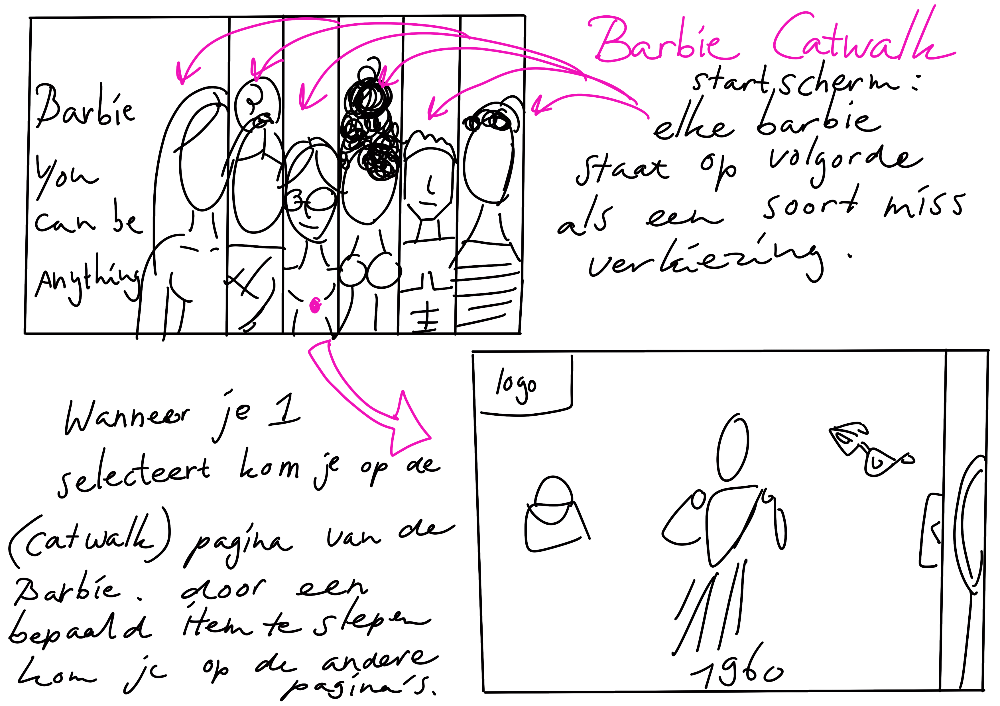
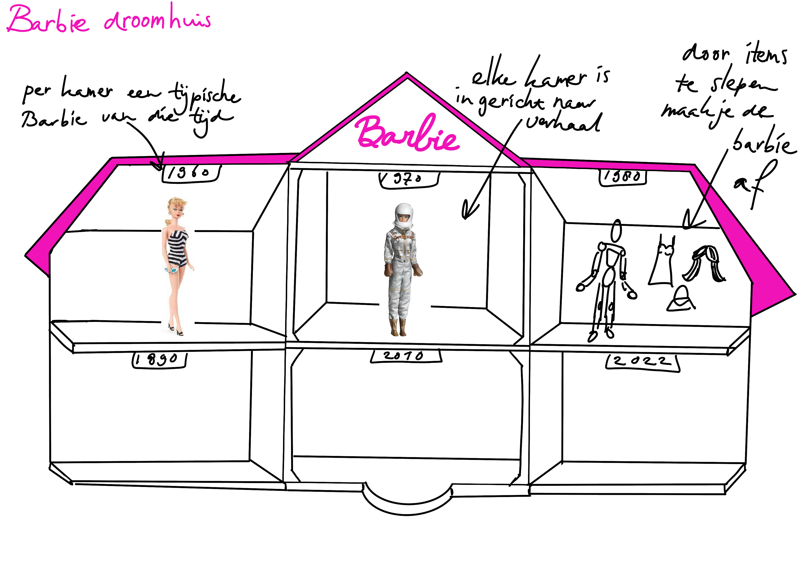
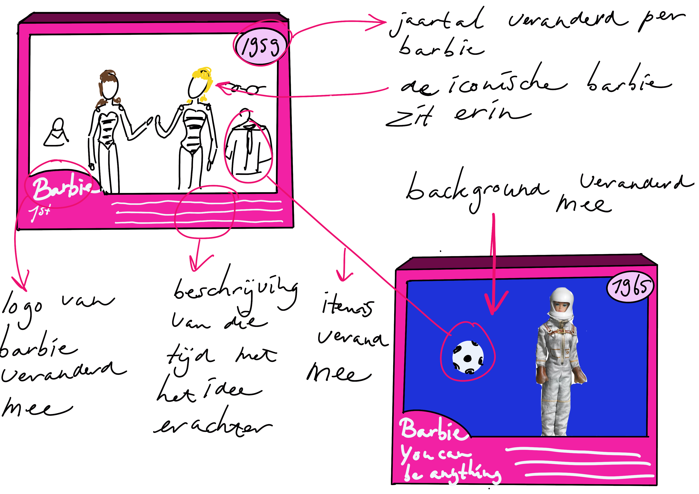
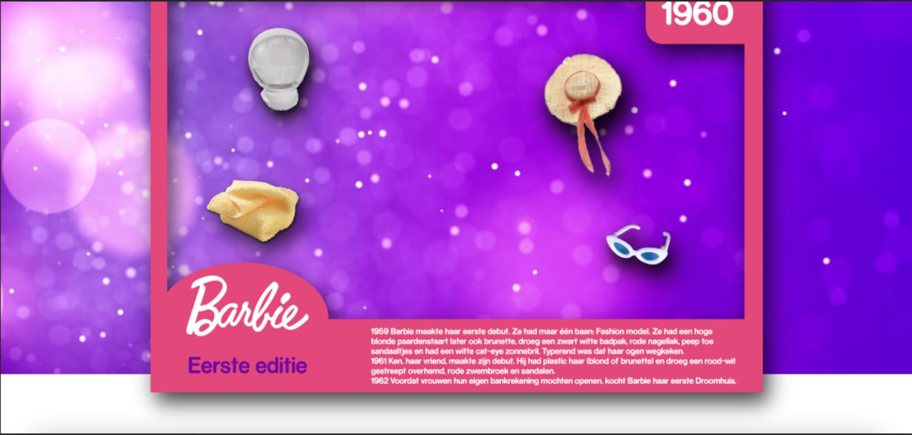
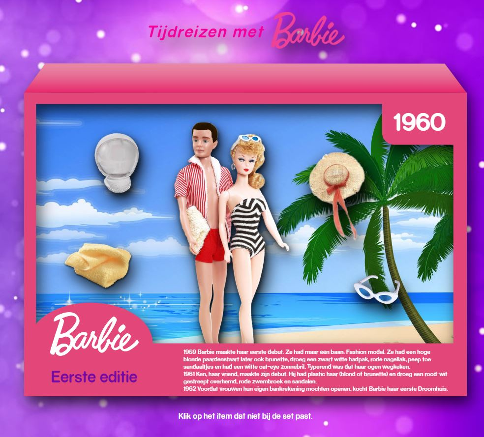
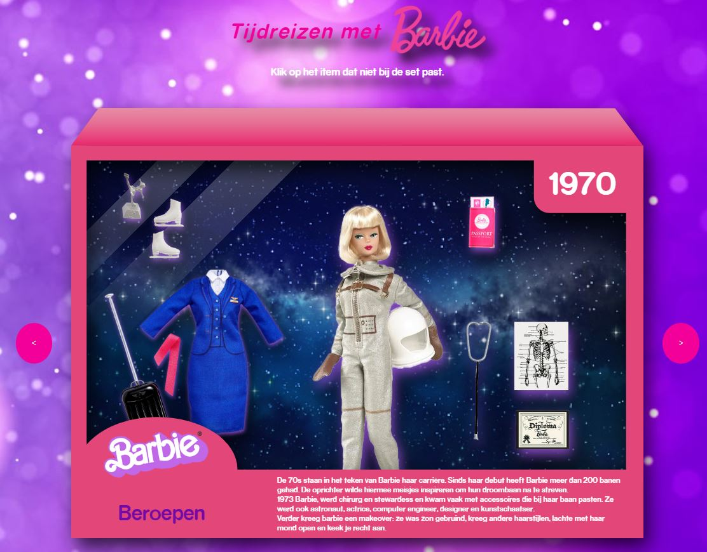

# Procesverslag
Markdown is een simpele manier om HTML te schrijven.  
Markdown cheat cheet: [Hulp bij het schrijven van Markdown](https://github.com/adam-p/markdown-here/wiki/Markdown-Cheatsheet).

Nb. De standaardstructuur en de spartaanse opmaak van de README.md zijn helemaal prima. Het gaat om de inhoud van je procesverslag. Besteedt de tijd voor pracht en praal aan je website.

Nb. Door *open* toe te voegen aan een *details* element kun je deze standaard open zetten. Fijn om dat steeds voor de relevante stuk(ken) te doen.

## Jij

### Ontwerper:
Nikki van der Meulen, 
SN: 500755777

#### Je startniveau:
Mijn startniveau is: Blauw.

# Je plan

  
De eerste ontwerpen

   ### De eerste schetsen:
    
  Idee 1: Barbie Catwalk

  

  Idee 2: Barbie's droomhuis

   

zie hier mijn proces in Miro: https://miro.com/welcomeonboard/a1NyQ2VNdkxTVWFrS1k0eWVnUTQ2RUhjb0FBQXY5V2RieW82OExlVk5VMjI4M3duam9ZZERUUG52Z1p5Qk00bHwzMDc0NDU3MzUwNDYyODk0NTc5fDI=?share_link_id=112984760417

en hier mijn githublink: 

  
De eerste versie/schets van je ontwerp & je persoonlijke uitdaging

  ### De eerste versie/schets:
  

### Barbie 
Mijn page zal bestaan uit de wel bekende barbie in doos. Elke doos bevat een unieke barbie met bijpassend jaartal, een titel en uitleg onderaan de doos. In de uitleg staat beschreven wat de gedachte van de maker was en wat er speelde in die tijd. Door iets te klikken wat niet in het plaatje past qua extra accessoires of op het jaartal van barbie kom je naar de volgende barbie en tijd. Elke accessoire zal een soort hover animatie bevatten. Bij de barbie beroepen kan je door accessoires van beroep barbie switchen. Ook het logo is door de jaren heen veranderd deze wil ik ook mee laten veranderen op de doos. Elke tijd heeft dus zijn eigen barbie met achtergrond en accessoires inclusief uitleg. Ik zit te denken aan 6 in totaal met aan het eind een barbie die nu zou typeren of een barbie die eruit ziet zoals ik met typische accessoires van mij.

Wat maakt Barbie uniek:  het is echt speelgoed dat ontworpen is voor meisjes door een vrouw. Barbie is bedoeld als een soort rolmodel en de maker wilde ze mee geven: je kan ook als vrouw zijn wie je maar wil zijn. De kracht van Barbie zit hem in de eindeloze variaties die mogelijk zijn door het kopen van outfits, verscheidene poppen en bijpassende items. Je kan zo je eigen wereld opbouwen met Barbie. Het is een middel voor jonge meiden om zich te kunnen identificeren en exploreren wat zij in het leven willen. Daarnaast veranderd barbie mee aan de hand van maatschappelijke gebeurtenissen van die tijd.

  ### Je ambitie: 
  Aan deze technieken/punten wil ik werken:
  - punt 1: JavaScript. Ik ben hier echt nog een dummy in en wil graag exploreren wat ik hier allemaal mee kan doen. 
  - punt 2: Ik wil een leuke interactieve tijdlijn neer zetten die echt mijn gekozen merk uit straalt.
  - punt 3: Ik wil iets persoonlijks verwerken in mijn ontwerp.
  - punt 4: Ik wil beter leren coderen, als in een goede html structuur en met CSS een juiste plaatsing van elementen.
 

## Voortgang/Feedback 1

  
Mijn bevindingen + wijzigingen (minimaal 5)

  
  Bevindingen:
  - Verscheidene mensen vonden mijn idee heel sterk. "Barbie haal je als collector's item niet uit de doos. En op de doos staat vaak alle informatie van het product."
  - Het idee van de doos als zoekplaatje vonden ze ook interessant.

  
  
  ### Bevinding 1:
  - Verlies niet uit het oog dat er ook items geanimeerd moeten worden.
  
 #### oplossing:
  ik heb gekeken naar css animaties, misschien bepaalde hover states verwerken kan ook al goed werken. zoals hoveren om de andere barbie van die editie te zien.

   

  ### Bevinding 2:
  - "Misschien is het goed om ervoor te zorgen dat na een aantal seconde het (foute) item op licht. Voor als ze het niet zien."

  #### oplossing:
  Dit zou ik kunnen doen met een css animatie binnen een aantal seconde.

  ### Bevinding 3:
  - Als je tijd over hebt: informatie op de achterkant van de box. Dus box kan je omdraaien.

  #### oplossing:
  met javascript de doos laten omdraaien na een click. (is niet gelukt vanwege de tijd)

  ### Bevinding 4:
  - Aan het einde sowieso een Barbie van jezelf.

  #### oplossing:
   Ik wilde zeker weten dat ik een Barbie straks heb die daadwerkelijk mij representateert. Dus heb ik een Google form uit gestuurd naar mijn vrienden en familie leden.
   deze heb ik vervolgens geanalyseert en verwerkt in mijn ontwerp.

  

## Voortgang/Feedback 2

  
Mijn bevindingen + wijzigingen (minimaal 5)

  
  ### Bevinding 1:
  De achtergrond met Gradient van paarsig naar roze zorgt ervoor dat je de titel niet meer ziet. 

  #### oplossing:
  Ik heb de achtergrond afbeelding veranderd zodat met de kleuren van het logo en de titel deze er meer uit springt en ik heb vervolgens ook een zwarte drop-shadow gegeven aan de letters in plaats van het licht roze.

 

  ### Bevinding 2:
  de items van de barbies moeten los zijn om te kunnen klikken

  #### oplossing:
  De eerste box staat met alle items in de html door middel van javascript met een switch case veranderen de items per box. (zie de code hiervoor)

  ### Bevinding 3:
  Zet de hulp van personen ook in je bronnen!

  #### oplossing:
  Ik heb zowel hulp van Jeffrey als Sanne ontvangen. 
  Sanne heeft geholpen met html opzet en bepaalde css styling.
  Jeffrey heeft me geholpen met JavaScript uit te zetten, hier ben ik vervolgens zelf mee verder gegaan om alle items per box aan te passen inclusief item aangeven dat "fout"is.
  Dit heb ik ook in het bestand als notitie gezet.

  ### Bevinding 4:
  CSS custom properties moeten nog gedefinieert worden.

  #### oplossing:
  Ik heb dit vooral aangemaakt voor de kleuren.

## Voortgang/Feedback 3

  
Mijn bevindingen + wijzigingen (minimaal 5)

### Bevinding 1:
 Responsiveness: via github is de background niet responsive ook laad hij niet altijd de doos achtergong inclusief barbies.
 Het is dan ook niet duidelijk wat je moet doen om naar de volgende doos te gaan aangezien de tekst hierdoor wegvalt.

  #### oplossing:
  dit komt door de content helaas en github laad niet alle foto's in helaas door een bug. hij zet extra puntjes voor de foto's.

  ### Bevinding 2:
  Niet erg duidelijk wat je moet doen om naar de volgende periode in de tijdlijn te komen, bij een ander grootte scherm kan je dit niet lezen tenzij je helemaal naar beneden scrollt.

  #### oplossing:
  Ik heb de uitleg tekst in de header gezet onder de titel zodat je deze eerder ziet nu is het  wel duidelijk.
 
 

  ### Bevinding 3:
  code volgorde van CSS is niet altijd logisch. zet bijv. width eerst en position, left, bottom enzovoorts bij elkaar. wees consistent.

  #### oplossing:
  Ik heb gekeken naar wat qua opmaak bij elkaar moet en zo een aantal regels ertussen gelaten zodat dit overzichtelijker eruit ziet.

 ### Bevinding 4:
  Je kan wel vooruit door je tijdlijn maar niet terug switchen naar voorgaande items. 
  
 #### oplossing:
  Om dit op te lossen heb ik buttons aan weerszijde gemaakt waarmee je naast de foute items ook door de boxen heen zou kunnen en dus ook weer terug.
  Om ervoor te zorgen dat je niet verder kan klikken heb ik er een grens aan gesteld in javaScript en de buttons vooruit bij de laatste op hidden gezet.

  

## Reflectie

  
Mijn eindresultaat & persoonlijke ontwikkeling

  ### Je uitkomst - karakteristiek screenshot(s):
  

Overall ben ik echt onwijs blij met wat ik (met hulp) heb neer gezet. Het ziet er echt uit als een barbie set in doos met alle jaartallen erbij en interactie.

  ### Dit ging goed/Heb ik geleerd: 
  Het ontwerp en onderzoeksgedeelte gingen vooral erg goed. Ik vind wat ik heb gemaakt qua design zeker bij Barbie passen als merk.
  Vooral mijn eigen barbie lijkt onwijs op mij en de andere barbies passen allemaal qua geheel goed bij elkaar.
  Het is echt als een soort collectors item gallerij en interactieve website van Barbie.
  Ook het gedeelte van interactie is goed gelukt. Het is een zoekplaatje geworde waarmee je op een speelse manier door de boxen heen kan.
  Maar je kan ook weer terug door middel van de pijltjes knoppen.
  En de hidden barbie bij bepaalde dozen die je kan vinden door erover heen te gaan met je cursor vind ik een leuk extratje.

  Ik ben heel slecht met code schrijven, na wat hulp van Sanne aan het begin gingen CSS en html mij al veel beter af. 
  Zo weet ik nu dat je plaatsingen van elementen met display grid of flexbox kan doen. Maar ook posities kan geven met relative en absolute en dan vanaf de bottom en top met em waardes verplaatsen. Zelfs javaScript snap ik nu al iets meer als iemand wat doet snap ik wat er gebeurd.

  

  

  ### Dit was lastig/Is niet gelukt:
  JavaScript was echt een hell! Ik ben Jeffrey zo dankbaar dat hij af en toe mee keek. Ik had het namelijk nooit in mijn ééntje op kunnen zetten.
  Ik snap wat er gebeurd als we het samen doen maar zelf alles uit schrijven is nog erg lastig.
  Ook het stukje grid en flexbox wil ik mij nog iets meer in gaan verdiepen na dit vak zodat ik dit beter voor me zie.
  
  Ik ben ook door de angst voor coderen op de helft van de eerste week begonnen met coderen op aandringen van Sanne.
  Hierdoor heb ik net 2 dagen misgelopen om nog wat extra dingen toe te voegen.
  Zo wilde ik nog hoverstates geven aan de knoppen en barbie accesoires.
  De knoppen wilde ik ook meer 3D maken.
  Verder had ik er nog een grappige animatie aan kunnen geven en de cursor kunnen veranderen in een handje met gelakte nageltjes.

  

## Bronnenlijst

continu bijhouden terwijl je werkt

Nb. Wees specifiek ('css-tricks' als bron is bijv. niet specifiek genoeg).

1. Sanne >  Css en Html code hulp, glimmers op de doos als plastic, opzet html semantisch.
2. Jeffrey > JavaScript, hulp met switch case en change content inclusief knoppen werkend krijgen.

